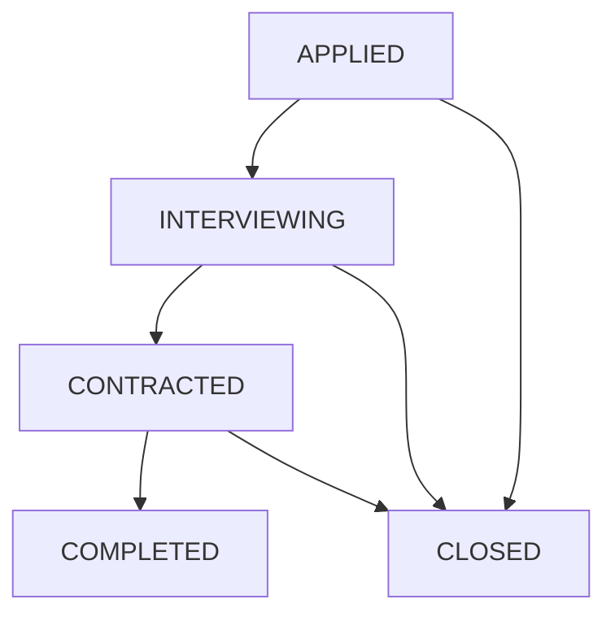

# Job Application State Machine

A NestJS application for managing job application lifecycles using a state machine. Features automated audit logging, role-based access control (RBAC), and transactional integrity using PostgreSQL & Prisma.

## Key Features

- **State Machine**: Validates transitions between application statuses (`APPLIED` → `INTERVIEWING` → `CONTRACTED` → `COMPLETED`).
- **Audit Logging**: Persists status changes in the `StatusHistory` table using Prisma transactions.
- **Security**: JWT authentication with custom `RolesGuard` for role-based access.
- **Email Notifications**: Automated notifications via Resend for registration and status updates.
- **User Management**: Endpoints for profile management and user listing.
- **Documentation**: Swagger UI for endpoint exploration and testing.

## Tech Stack

- **Framework**: [NestJS](https://nestjs.com/)
- **Database**: [PostgreSQL](https://www.postgresql.org/)
- **ORM**: [Prisma](https://www.prisma.io/)
- **Email**: [Resend](https://resend.com/)
- **Auth**: [Passport.js](https://www.passportjs.org/)

## Application Lifecycle



## Getting Started

### Prerequisites
- Node.js (v18+)
- PostgreSQL

### Setup
1. Copy `.env.example` to `.env` and configure your database, Resend API key, and JWT secret.
2. Install dependencies:
   ```bash
   npm install
   ```
3. Initialize the database:
   ```bash
   npx prisma db push
   ```

### Running the App
```bash
# Development
npm run start:dev

# Production
npm run build
npm run start:prod
```

## Testing
```bash
npm run test
```

## API Access

- **Swagger UI**: `http://localhost:3000/api/docs`
- **Postman**: Import `postman/job-application-api.postman_collection.json`

### Seed Users (Development)
| Role | Email | Password |
| :--- | :--- | :--- |
| Admin | `admin@example.com` | `admin123` |
| Company | `company@example.com` | `company123` |
| Candidate | `candidate@example.com` | `candidate123` |

## License
MIT
