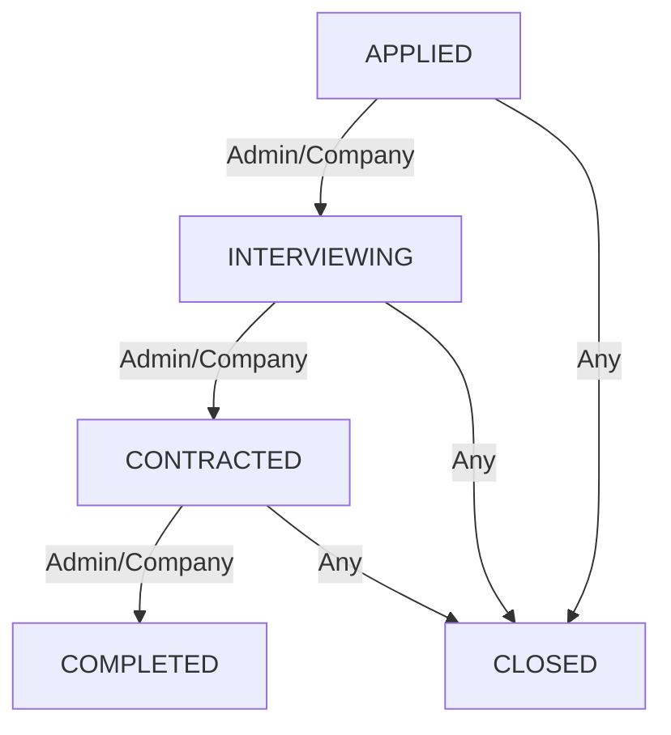

# 🚀 Job Application State Machine

A production-ready NestJS application designed to manage the lifecycle of job applications through a strict **State Machine**. It features automated audit logging, Role-Based Access Control (RBAC), and transactional integrity using PostgreSQL & Prisma.

---

## ✨ Key Features

- **🛡️ Strict State Machine**: Ensures applications only move through valid statuses (`APPLIED` → `INTERVIEWING` → `CONTRACTED` → `COMPLETED`).
- **📝 Automated Audit Logs**: Every status change is atomically logged in the `StatusHistory` table within a Prisma transaction.
- **🔐 Secure Authentication**: JWT-based login system with `bcrypt` password hashing.
- **👮 RBAC Enforcement**: Custom `RolesGuard` ensures only authorized users (Admin, Company, or Candidate) can perform specific actions.
- **📧 Email Notifications**: Integrated with **Resend** for automated emails on account creation and every application status change, featuring exponential backoff retries.
- **👤 User Management**: Dedicated module for profile management and user listing (Admin-only).
- **📖 API Documentation**: Fully documented via **OpenAPI (Swagger)** with interactive testing.
- **🧪 High Test Coverage**: Comprehensive unit tests for core services and state transitions.

---

## 🛠️ Tech Stack

- **Framework**: [NestJS](https://nestjs.com/)
- **Database**: [PostgreSQL](https://www.postgresql.org/)
- **ORM**: [Prisma](https://www.prisma.io/)
- **Email**: [Resend](https://resend.com/)
- **Auth**: [Passport.js](https://www.passportjs.org/) (JWT Strategy)
- **Validation**: [class-validator](https://github.com/typestack/class-validator)

---

## 🔄 Application Lifecycle (State Machine)

The application follows a strict sequence to ensure data integrity:



> [!NOTE]
> Any application can be moved to the **CLOSED** state at any time by authorized users.

---

## 🚀 Getting Started

### 1. Prerequisites
- Node.js (v18 or higher)
- PostgreSQL instance

### 2. Environment Setup
Copy the example environment file and fill in your credentials:
```bash
cp .env.example .env
```

**Required Variables**:
- `DATABASE_URL`: Your PostgreSQL connection string.
- `RESEND_API_KEY`: API key from your [Resend dashboard](https://resend.com/).
- `EMAIL_FROM`: The sender email address.
- `JWT_SECRET`: A secure string for signing tokens.

### 3. Installation & Database
```bash
# Install dependencies
npm install

# Push the schema to your database
npx prisma db push
```

### 4. Running the App
```bash
# Development mode
npm run start:dev

# Production mode
npm run build
npm run start:prod
```

---

## 🧪 Testing

The project uses Jest for unit testing:
```bash
# Run all tests
npm run test

# Run tests with coverage
npm run test:cov
```

---

## 📡 API Documentation

Once the app is running, you can explore and test the endpoints visually:

🔗 **Swagger UI**: [http://localhost:3000/api/docs](http://localhost:3000/api/docs)

### Postman
A pre-configured Postman collection is available in the repository:
`postman/job-application-api.postman_collection.json`

### Seed Users
The system automatically seeds these accounts on startup for testing:
| Role | Email | Password |
| :--- | :--- | :--- |
| **Admin** | `admin@example.com` | `admin123` |
| **Company** | `company@example.com` | `company123` |
| **Candidate** | `candidate@example.com` | `candidate123` |

---

## 📜 License
Distributable under the MIT License. See `LICENSE` for more information.
